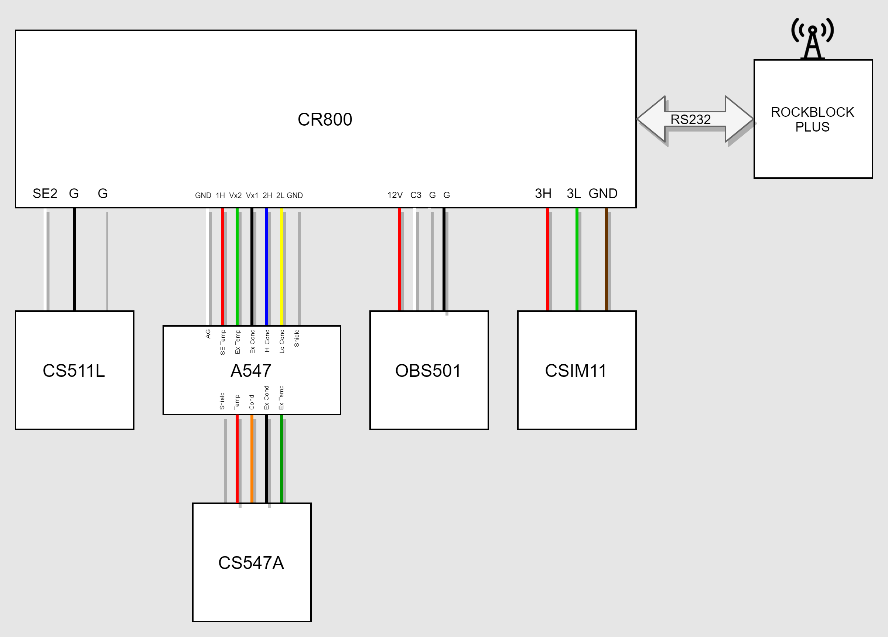

# Estación de monitoreo de calidad de agua

La estación de monitoreo de calidad está basada en un datalogger Campbell CR800 y cuenta con distintos sensores para medir variables en un curso de agua. Estas variables son medidas, almacenadas y subidas a la nube mediante un modem satelital.

## Componentes:

- Datalogger CR800
- Modem satelital RockBlock Plus
- Sensor de turbidez OBS501
- Sensor de oxígeno disuelto CS511-L
- Sensor de conductividad CS547A
- Sensor de pH CSIM11

## Conexión de sensores y modem

Las conexiones pueden encontrarse detalladas en [este documento](docs/Datalogger/Conexion_Sensores.xlsx) o en el siguiente grafico

## Funcionamiento

El funcionamiento del programa esta explicado en [este documento](docs/Funcionamiento.md).

## Datos enviados

Los datos que se envían mediante el modem satelital se detallan en [este documento](docs/Trama.xlsx)

---

# Changelog

## v1.1.1

Instalación programada para el 29/12/2021

### Características:

- En caso de que un dato no pueda ser enviado, este se encola y se envía en el siguiente periodo de transmisión.
- Report ID cambiado a 0x03:
  - Agregada timestamp (según UNIX Epoch) de la transmisión.
  - El valor de turbidez se envía en FBU (sin multiplicación o división).

### BugFixs:

- Ahora la estación si envía los datos mediante el modem satelital.

## v1.1

Instalada el 15/12/2021

> **Esta versión no debe ser usada debido a sus errores conocidos.**

### Características:

- Código reestructurado para mayor claridad.
- La tensión de batería se almacena cada 8 horas.

### Bugs conocidos:

- No sube datos al modem debido a un error en la comunicación con este.

## v1.0

Instalada el 13/10/2021

# Autores

Creado por Agustín Allegui para ProMatix SRL.

Basado en el programa creado por Emir Dagfal.
