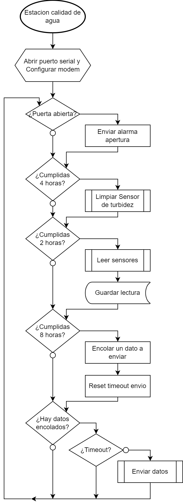
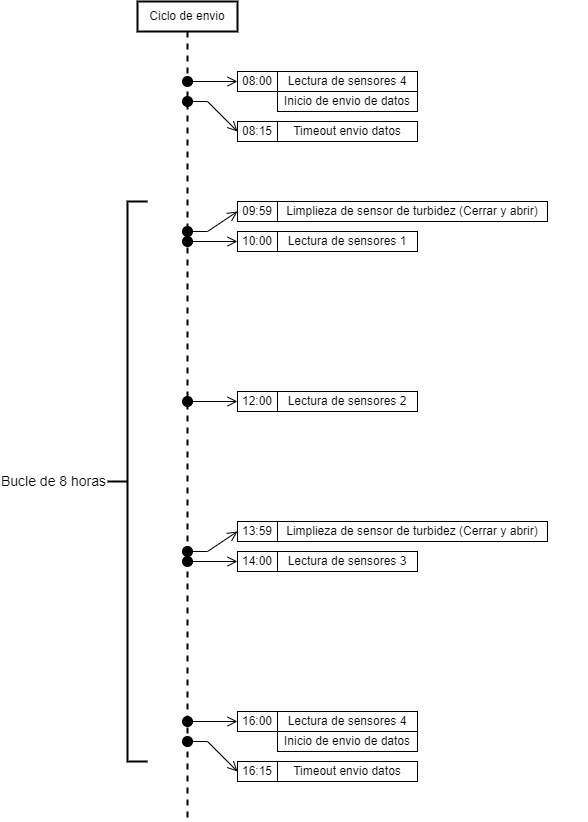
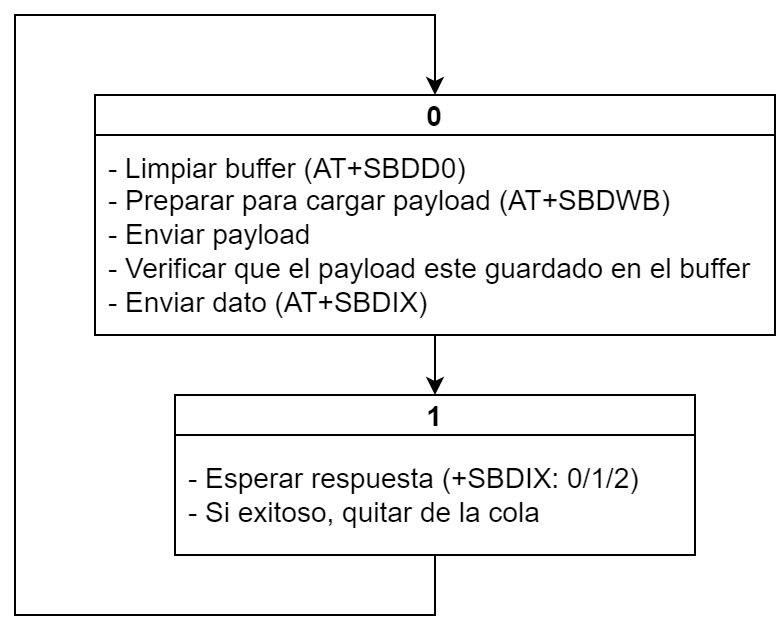
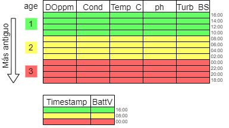

# Funcionamiento del programa

Después de inicializar variables, el programa consiste de un bucle en el que las distintas tareas se realizan si se cumplen las condiciones para la misma.

A continuacion se muestran las tareas en una linea de tiempo

### Tareas:

- **Lectura de sensores**: (Cada 2 horas) Se leen todos los datos de los sensores y se almacenan en una tabla.
- **Encolar un dato**: (Cada 8 horas) Se agrega un dato a la cola de envío. Este dato consiste en las últimas 4 lecturas de sensores.

- **Enviar datos**: (Cuando hay datos encolados) Se ejecuta un estado de la FSM para envío.

> Nota: La alarma antivandálica no ha sido probada en forma exhaustiva y no debe usarse hasta que se lleven a cabo las pruebas correspondientes.

## FSM para envío

Cada vez que se llama a ejecutar la FSM para envió, se ejecutan las tareas correspondientes al estado actual de la FSM. Al finalizar la ejecución, el estado se modifica según el resultado de la operación.

Llamar consecutivamente a la FSM resultara en el envío de los datos a través del modem.

La presencia de datos en la cola para enviar se expresa en la variable _PendingMessages_ (_age_ en el diagrama). Si esta variable es mayor que 0, indica cuan antiguos son los datos que deben enviarse.

Por ejemplo, en el siguiente diagrama, si _age_=2, se enviaran los datos marcados en amarillo. Si el envío es exitoso, se resta 1 a _age_ y el siguiente envió consistirá en los datos marcados en verde.

